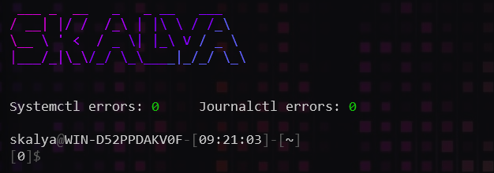

### Content

- [x] Bash settings
- [x] Readline settings
- [x] Neovim settings
- [x] Git settings

> Ubuntu (WSL) based setup

### Install

```bash
sudo apt install -y make
sudo apt install -y figlet
sudo apt install -y lolcat
# Then install neovim
```

```bash
make
# Then resolve neovim :checkhealth
```
