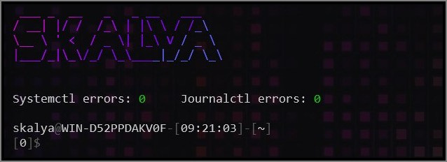

### Content

- [x] Bash settings
- [x] Readline settings
- [x] Neovim settings
- [x] Git settings

> Ubuntu (WSL) based setup

### Install

```bash
#==========================#
# Bash config requirements #
#==========================#

sudo apt install -y figlet
sudo apt install -y lolcat
```

```bash
#==================================#
# Neovim :checkhealth requirements #
#==================================#

sudo apt install -y nodejs
sudo apt install -y npm
sudo apt install -y python3-venv
sudo apt install -y ripgrep

# Then install NVM
# Then source ~/.bashrc

nvm install node
npm install -g neovim
npm install -g tree-sitter-cli

python3 -m venv ~/.local/share/pyenv
source ~/.local/share/pyenv/bin/activate
pip install pynvim
```

```bash
#============#
# Neovim LSP #
#============#

# Python
npm install -g pyright
pip install ruff-lsp

# Bash
npm install -g bash-language-server

# JS/TS
curl -fsSL https://deno.land/install.sh | sh

# Rust
# Install rustup first
rustup component add rust-analyzer

# C/C++
sudo apt install -y ccls

# Dockerfile
npm install -g dockerfile-language-server-nodejs

# Lua
# https://luals.github.io/wiki/build/
```
