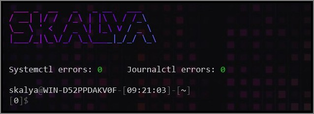

```bash
sudo apt install -y \
    make \
    nodejs \
    npm \
    lolcat \
    figlet
```

```bash
URL=https://github.com/Skalyaev/a-linux-home
DST=~/.local/src/a-linux-home

mkdir -p $(dirname $DST)
git clone $URL $DST
cd $DST && make
```
